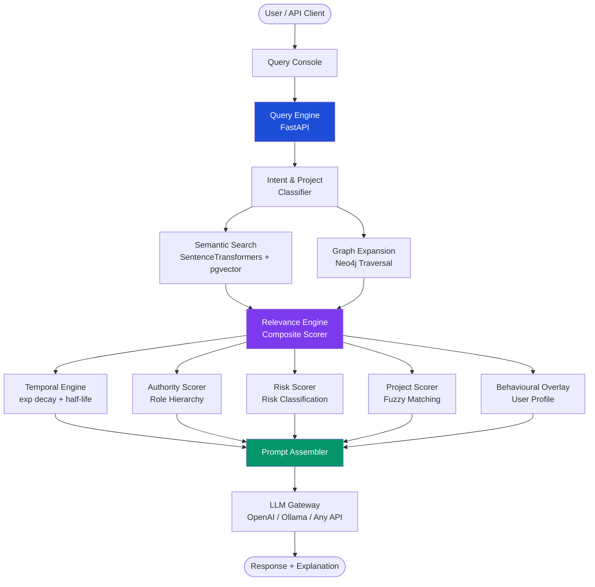
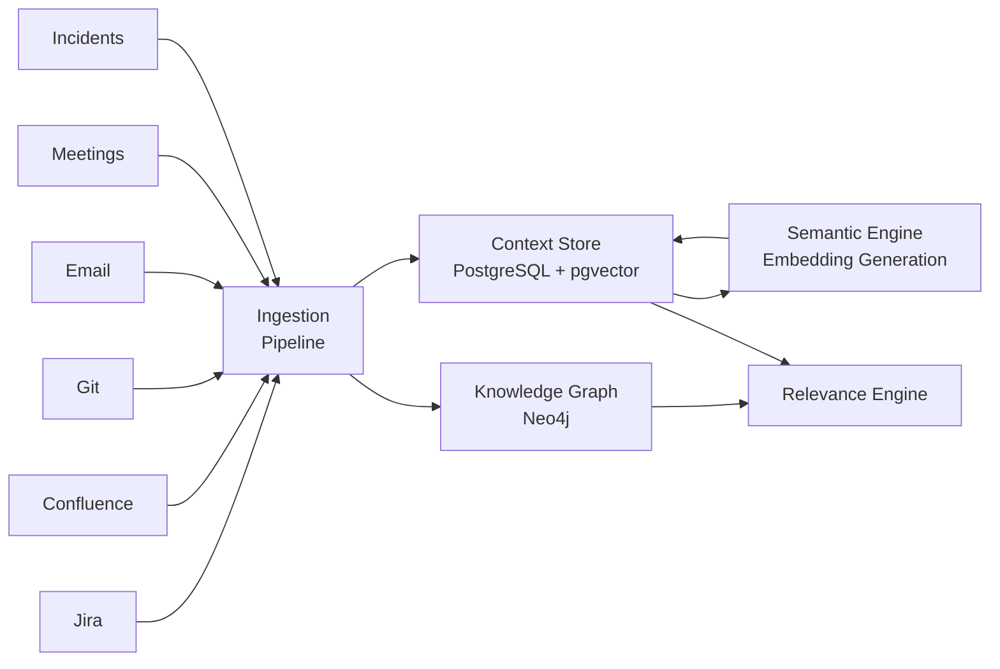
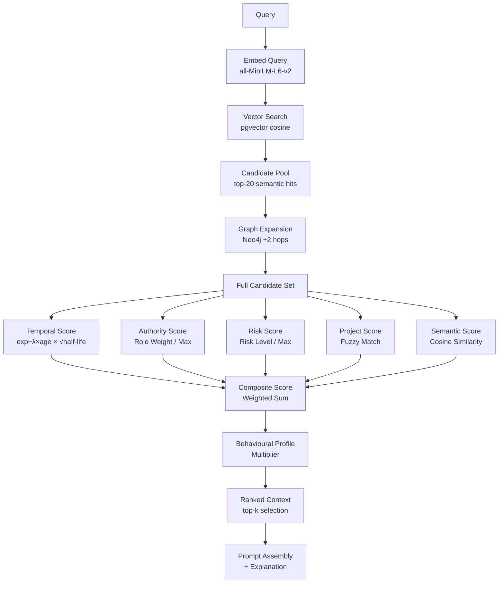
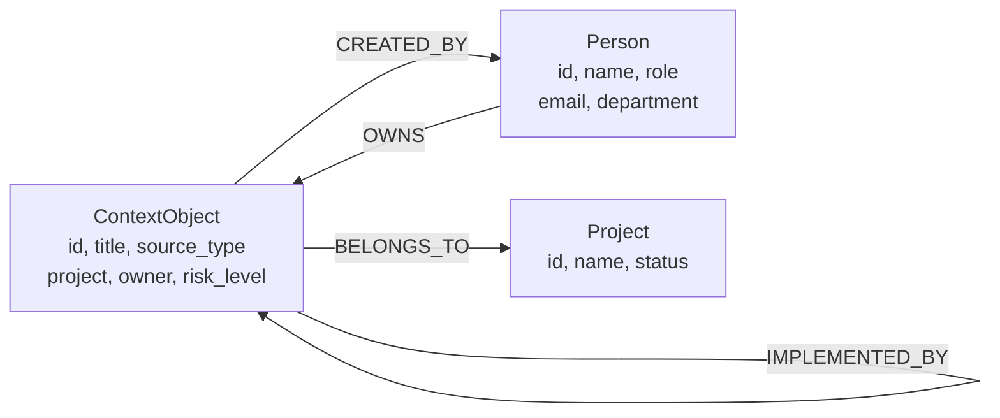
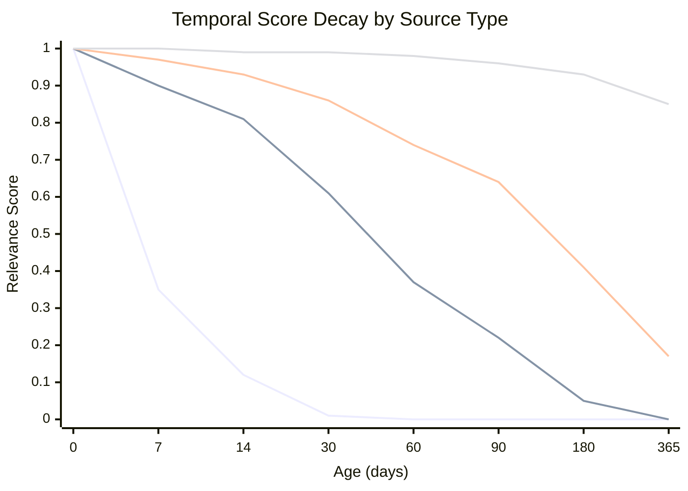
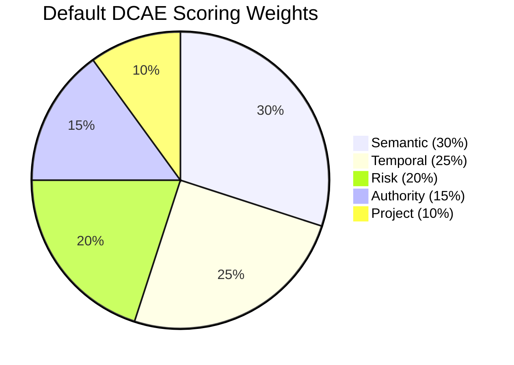
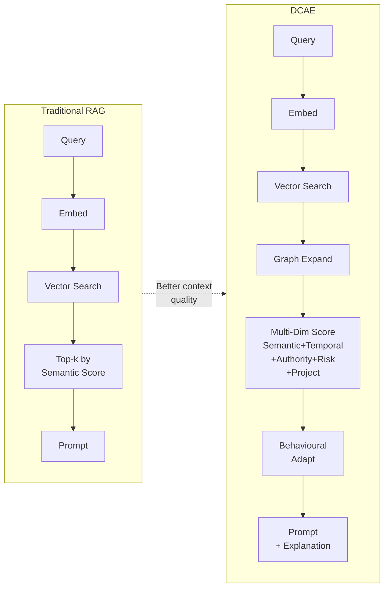
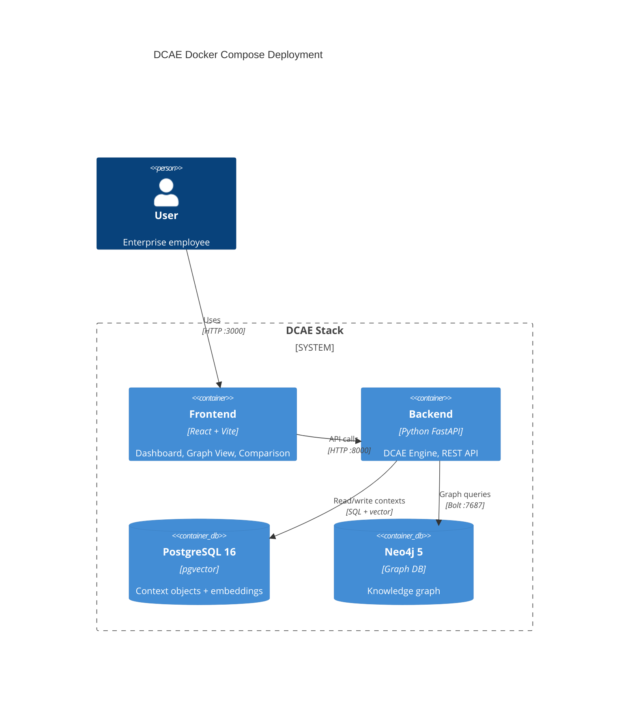

# DCAE Architecture Diagrams

All diagrams use Mermaid notation and are rendered by GitHub, GitLab, and most modern documentation platforms.

---

## 1. High-Level System Architecture

---

## 2. Data Ingestion Architecture

---

## 3. Composite Scoring Pipeline

---

## 4. Knowledge Graph Schema

---

## 5. Temporal Decay Comparison

*Lines: Standup (fastest decay) → Sprint Report → Incident → ADR (slowest decay)*

---

## 6. Scoring Weight Distribution (Default)

---

## 7. DCAE vs RAG Information Flow

---

## 8. Deployment Architecture

